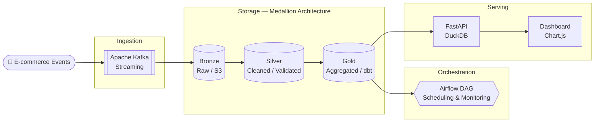
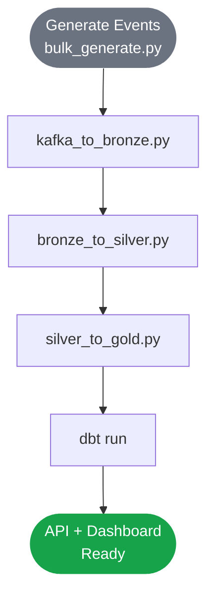
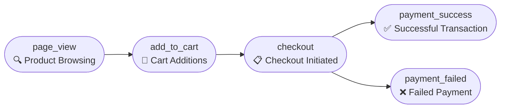

# GlowCart — E-commerce Data Platform

> End-to-end data engineering portfolio project simulating a real-time Indonesian e-commerce analytics platform.


---

## Architecture



---

## Tech Stack

| Layer | Technology | Purpose |
|-------|-----------|---------|
| Ingestion | Apache Kafka | Real-time event streaming |
| Storage | Parquet + Medallion Architecture | Bronze / Silver / Gold layers |
| Transform | PySpark + dbt | Large-scale aggregations + SQL models |
| Orchestration | Apache Airflow | Pipeline scheduling + monitoring |
| Serving | FastAPI + DuckDB | Analytics API endpoints |
| Visualization | Chart.js | Business intelligence dashboard |
| Infrastructure | Docker Compose | Local containerized environment |

---

## Project Structure

```
glowcart/
├── ingestion/
│   ├── kafka/          # Kafka producer & consumer
│   └── scripts/        # Event generators (10,000+ events)
├── storage/
│   ├── bronze/         # Raw data ingestion
│   ├── silver/         # Cleaned & validated data
│   └── gold/           # Business-ready aggregations
├── transform/
│   ├── spark/          # PySpark transformation jobs
│   └── dbt/            # dbt models & data quality tests
├── orchestration/
│   └── dags/           # Airflow DAG definitions
├── serving/
│   ├── api/            # FastAPI analytics endpoints
│   └── dashboard/      # Chart.js business dashboard
└── docker-compose.yml  # Full stack infrastructure
```

---

## Data Pipeline



---

## Quick Start

### Prerequisites
- Docker Desktop with WSL2 integration
- Python 3.12+
- Java 21 (for PySpark)

### Run the full stack

```bash
# 1. Start infrastructure
docker compose up -d

# 2. Activate Python environment
python3 -m venv .venv && source .venv/bin/activate
pip install -r requirements.txt

# 3. Generate 10,000 e-commerce events
python3 ingestion/scripts/bulk_generate.py

# 4. Run pipeline
python3 storage/bronze/kafka_to_bronze.py
python3 storage/silver/bronze_to_silver.py
python3 storage/gold/silver_to_gold.py

# 5. Run dbt models
cd transform/dbt && dbt run

# 6. Start API + Dashboard
uvicorn serving.api.main:app --host 0.0.0.0 --port 8000
```

---

## API Endpoints

| Endpoint | Description |
|----------|-------------|
| `GET /` | API info |
| `GET /health` | Health check |
| `GET /api/revenue` | Revenue by product category |
| `GET /api/funnel` | Conversion funnel metrics |
| `GET /api/top-products` | Top products by revenue |
| `GET /api/hourly-activity` | Traffic patterns by hour |

---

## Data Model



---

## Key Features

- **Real-time streaming** — Kafka producer simulates live Indonesian e-commerce events
- **Medallion architecture** — Bronze / Silver / Gold data lakehouse pattern
- **Data quality** — Automated dbt tests (uniqueness, not-null, accepted values)
- **Scalable transforms** — PySpark for large-scale aggregations
- **Orchestration** — Airflow DAG with 6-task daily pipeline
- **Analytics API** — FastAPI with auto-generated Swagger documentation
- **BI Dashboard** — Dark-theme real-time dashboard with Chart.js

---

## Author

**Khairunnisa Maharani** — Data Science Student, Institut Teknologi Sumatera (ITERA)
